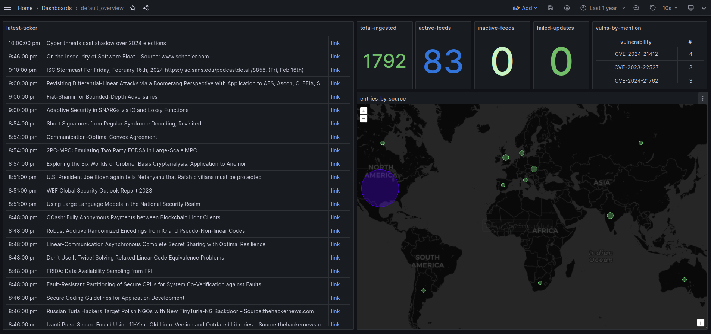

# SigSort (v0.1)
## Overview
SigSort (SignalSort) is a news aggregation and processing platform designed to ingest cybersecurity-related content and distill tangible, actionable insights for enthusiasts and professionals alike.

Built with Python and packaged with Docker, SigSort combines easy out-of-the-box operation with extensive customization and scalability, ensuring a user-friendly experience alongside deep technical flexibility.



## Features

- **News Aggregation**: By default, SigSort aggregates cybersecurity-related news from a wide array of RSS feeds and provides a simple integration process for new data sources.
- **Advanced Filtering**: Using NLP-based processing in combination with user-defined rules, SigSort extracts relevant information from ingested content, enabling rich downstream queries and visualizations. Processing steps can arranged in any logical order you choose, and data can be enriched in various ways.
- **Visualized Insights**: Visualize your data with Grafana to enable informed decision-making based on the latest cybersecurity threats and trends.
- **Dockerized Deployment**: With the help of Docker Compose, SigSort ensures easy deployment and scalability, supporting a seamless integration into any cybersecurity workflow.

## Getting Started

### Prerequisites
-   Docker Compose ([related requirements](https://docs.docker.com/compose/))
- Recommended host specs:
    - CPU: 2+ cores
    - RAM: 8GB+
    - Storage: depends heavily on your ingestion rate, but 20-50GB is a solid foundation

### Installation

1. Inside your terminal of choice, clone the SigSort repository:

	```bash
	git clone https://github.com/danc1232/SigSort.git
	```
2. Navigate to the `SigSort` directory and copy the `config/.env-template` file into the `app/` directory, then rename it to `.env`:
	
	```bash
	cd SigSort
	cp config/.env-template app/.env
	```

3. Copy the default `config.yaml-template` into your own `config.yaml`:

    ```bash
    cp config/config.yaml-template config/config.yaml
    ```

	The application is now ready to run with default settings, but if you want to make any tweaks (add/remove data feeds, adjust keyword/entity lists, etc.), refer to the **Customization** section.

    Also, **I strongly suggest** changing the default credentials in your `.env` file before continuing beyond this point.

	If you want to make any other changes to the default project structure (pictured below), make sure to adjust your `.env` file to reflect the new project paths.

	```bash
    # Default Project Structure:
    # SigSort/
    # |-- app/
    #    |-- (...)
    #    |-- .env <-- (required) IF CHANGING PATHS, REFLECT CHANGES HERE
    # |-- config/
    #    |-- (...)
    #    |-- config.yaml <-- (required) MODIFY THIS FOR CONFIG TWEAKS
    # |-- LICENSE
    # |-- README.md
    ```
4. Use `docker compose up` to run SigSort.

## Customization

SigSort is designed to be as configurable as possible.

#### Data sources 
(currently limited to RSS feeds): Configured by modifying the `feeds.csv` located by default in the `app/database/` directory.
<br>
Each feed has the following properties (italicized = required):

*`name`* | *`url`* | `type` | `location` | `status`
---|---|---|---|---
Display name of feed | Source link | Type of content | ISO Alpha-3 code | Enabled/Disabled (default Enabled)

`types` are static tags assigned to feeds that can be used for source-level filtering. Default types and their intended (completely subjective and optional) use cases are:
- `aggregator` -  mixed / aggregated content
- `blog` - personal blog or blog-style commercial content
- `vendor` -  content released by vendors, often about related products
- `news` -  general category for primarily news-based content
- `gov` -  advisories, reports, and other content released by government sources
- `org` -  generally similar to gov, but not directly associated with any governments or geo-political entities

> `types` and all other default data structures can also be modified by editing the database schema file, located by default in the `app/database/schema.sql` file.

A significantly more modular data ingestion template for varied source types is on the roadmap - stay tuned for updates.

<hr>

#### .env
The `.env` file is used to distribute environment variables to the `compose.yaml` file and other files in the base app directory. Default container credentials (among a few other things) are defined here, and should ideally be changed.

<hr>

#### config.yaml
`config.yaml` is the central configuration file distributed across the platform. Use this file to tweak everything from global log level to refresh interval to maximum extracted keywords per content item.

A more detailed breakdown of all the configurable options within this file will be provided here eventually - for more information now, the file itself is commented relatively thoroughly.

<hr>

#### Dashboards / Data Visualizations

Currently SigSort ships with one example dashboard, located in the `app/grafana/dashboards` directory. 

To use it, navigate to your Grafana instance and from the top left dropdown menu select *Dashboards > New > Import*, then use the "Upload dashboard JSON file" interface to select the `default_overview.json` file.

> If you've made any changes to the database, note that the queries in imported dashboard panels may need to be adjusted accordingly.

More dashboards and library panels will be added this way as development continues.

## Usage

Details on how to use SigSort, including example commands and more advanced configuration options will be enumerated in a future update.

## Maintenance / Contributions
**TL;DR - I AM NOT A DEVELOPER**

SigSort is currently an experiment/hobby project, and as such any expectations regarding *support* or *active development* need to be tempered accordingly. I will continue chipping away at this project as time and focus permits, but I make no promises regarding adherence to the development roadmap (if one is ever published), prompt responses to bug reports, etc.

I would be happy to incorporate additional features and functionality from anyone who is willing to collaborate, provided your contributions don't deviate *too* drastically from my vaguely-defined internal vision for this project. That being said, if you are looking to make radical changes, please feel free to create a fork and build your own variation - I would be happy to exchange ideas and notes!

## License

SigSort is licensed under the GNU Public License (GPL-3.0).

See the LICENSE file for additional details.

## Author 
Daniel Casey - [danieltcasey@pm.me](mailto:danieltcasey@pm.me)


## Acknowledgments

Special thanks to the following for making SigSort possible:
- countless other open-source projects
- public data sources and APIs
- caffeine


